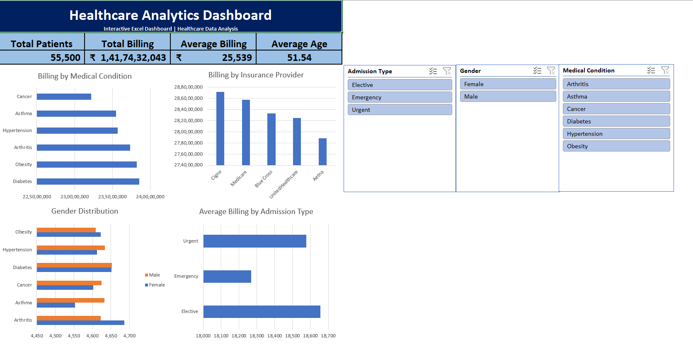

# 🏥 Healthcare Analytics Dashboard (Excel)

## 📌 Overview

This project is an interactive Healthcare Analytics Dashboard built using Microsoft Excel. It analyzes patient records, billing information, insurance providers, medical conditions, and admission types to provide meaningful business insights through Pivot Tables, Pivot Charts, KPIs, and Slicers.

---

## 🧠 Skills Demonstrated

- Data Cleaning
- Data Analysis
- Microsoft Excel
- Pivot Tables
- Pivot Charts
- Dashboard Design
- Data Visualization
- Business Insight Generation
- Interactive Slicers
- KPI Reporting

---

## 📂 Dataset

- Records: 55,500
- Domain: Healthcare
- Format: CSV
- Tool Used: Microsoft Excel

---

## 🎯 Objectives

- Analyze patient demographics.
- Compare billing across medical conditions.
- Analyze insurance provider performance.
- Study admission types.
- Build an interactive dashboard using Excel.

---

## 🚀 Project Highlights

- 📊 Built an interactive Excel dashboard using Pivot Tables and Pivot Charts.
- 🏥 Analyzed **55,500** healthcare records.
- 💰 Tracked billing trends across medical conditions and insurance providers.
- 🎛️ Added interactive slicers for dynamic filtering.
- 📈 Designed KPI cards for Total Patients, Total Billing, Average Billing, and Average Age.
- 💡 Generated business insights from healthcare data.

  
---

## 🛠 Tools Used

- Microsoft Excel
- Pivot Tables
- Pivot Charts
- Slicers
- Excel Functions (IF, COUNTIF, SUMIF, AVERAGEIF)

---

## 📊 Dashboard Preview

---

## 📈 Key Insights

- Diabetes generated the highest total billing amount.
- Elective admissions had the highest average billing.
- Billing varied across insurance providers.
- Male and female patient counts were nearly balanced.
- Interactive slicers allow dynamic analysis.

---

## 📁 Project Structure

Healthcare-Analytics-Dashboard/
│
├── Healthcare Analytics Dashboard.xlsx
├──dashboard.png
├── README.md
├── dataset/
│   └── healthcare_dataset.csv
└── images/
    └── dashboard.png , Using Slicers.png

---

## 🚀 How to Use

1. Download the Excel workbook.
2. Open it in Microsoft Excel.
3. Go to the Dashboard sheet.
4. Use slicers to interact with the visualizations.

---

## ⭐ Learning Outcomes

Through this project, I learned:

- Data cleaning in Excel
- Pivot Tables
- Pivot Charts
- Interactive Dashboards
- Slicers
- Business Insight Generation
